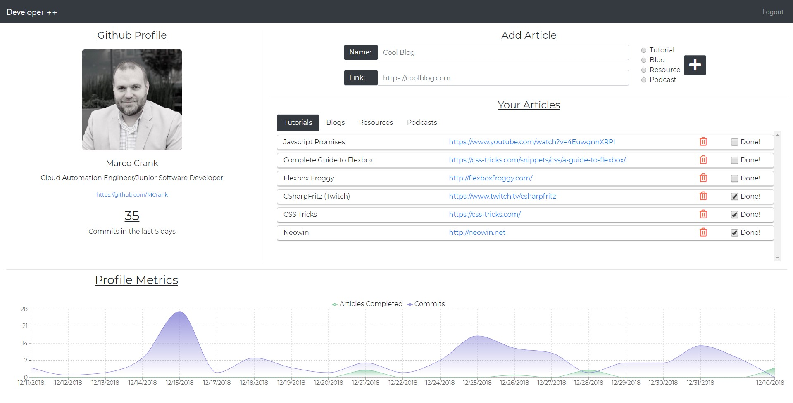

# Developer ++

This homework project was built to test our skills in using React in addition to all our previous lessons. We were tasked with building a developer resource tracking portal with the following requirements

## Requirements

- Use create-react-app to start a new react project
- Leverage Github projects for task tracking
- Add Github Authentication via Firebase
- Use the Mockup below to plan our React Component decisions
- When a user is not logged in they should see a NavBar with a login button
- When a user is logged in they should see the navbar with a logout button and the mockup layout
- A user should be able to see some basic information about their GitHub Profile
- A user should see a count of commits performed in the last 5 days
- A user should be able to add articles to their portal and categorize them as (Tutorial, Blog, Resource, or Podcast)
- A user should be able to mark an article as complete and that article should show below non-complete articles
- A user should be able to delete articles
- **[Bonus]** A user should see a graph with a line representing commits and a line representing resources marked complete over the last 60 days.

## Screenshot

## How to run this project

### Requirements

- Firebase Account - (https://firebase.google.com/)
- Github Account - (https://github.com/)
- Windows Users may need to install _**win-node-env**_ globally or as optional dependency to the project
  - `npm install -g win-node-env`
  - `npm install --save-optional win-node-env`

### Start Project

- Setup Firebase
  - Create a project
  - Enable Github Authentication - [Before you Begin Section](https://firebase.google.com/docs/auth/web/github-auth?authuser=0)
  - Create a Firebase **Realtime Database** (Not Firestore)
  - Create Index in Rules (Look at /db/firebaseRules.json)
- Clone the repo
- Browse to the repo directory in your terminal
- Type `npm install` to install dependencies
- Type `npm start` to run the project at [http://localhost:3000](http://localhost:3000)
